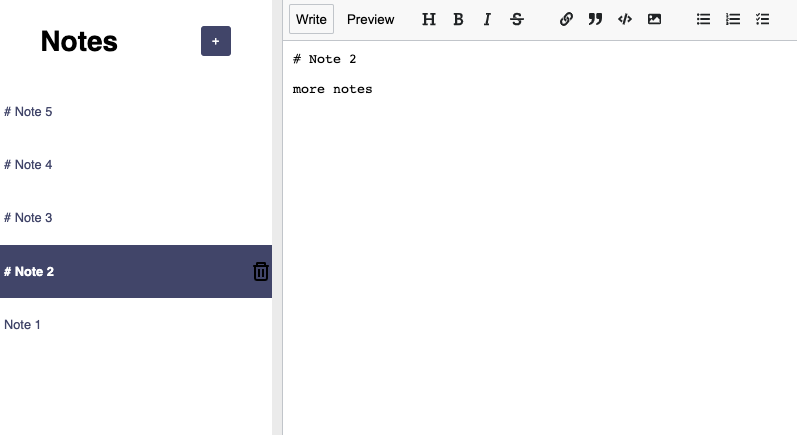
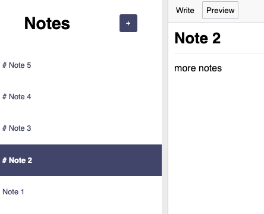

# React Notes App

## Table of contents

- [Overview](#overview)
  - [Summary](#summary)
  - [Screenshot](#screenshot)
  - [Links](#links)
- [My process](#my-process)
  - [Built with](#built-with)
  - [What I learned](#what-i-learned)
  - [Continued development](#continued-development)
- [Author](#author)

## Overview

### Summary

A very simple react CRUD app using local storage. The notes app lets the user type a note in markup and preview it. The most recently edited note will jump to the top of the sidebar.

### Screenshot

### Links

- Live Site URL: [Add live site URL here](https://zingy-capybara-34fb14.netlify.app/)

## My process

### Built with

- Semantic HTML5 markup
- CSS custom properties
- Create-react-app
- [React](https://reactjs.org/) - JS library
- [React-mde](https://www.npmjs.com/package/react-mde) - React markdown-editor
- [React-showdown](https://www.npmjs.com/package/react-showdown) - Render React components within markdown and markdown as React components!
- [React-split](https://www.npmjs.com/package/react-split) - Easily render a re-sizeable split frame

### What I learned

This was part of Scrimba's react course taught by Bob Ziroll. It was a nice refresher course for react and hooks, and there was a lot of practical javascript use cases in the app for practicing/brushing up on react.

### Continued development

This would be fun to style more on the front end or add an actual backend to

## Author

- LinkedIn - [Layne Taylor](https://www.linkedin.com/in/layne-taylor/)
- Twitter - [@laynerzzzz](https://www.twitter.com/laynerzzzz)

